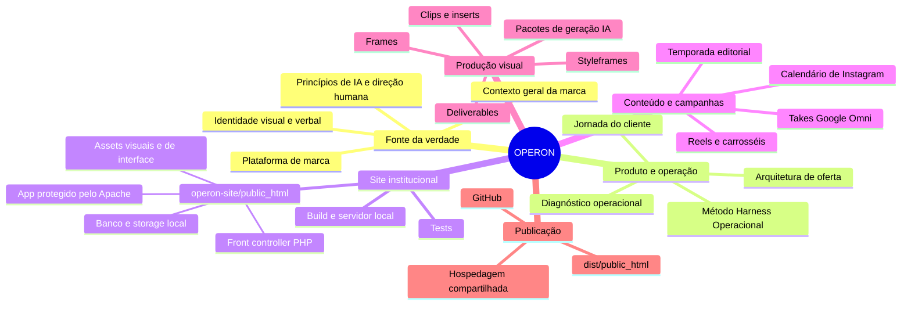

# OPERON

Sistema de marca, conteúdo e operação para transformar sinais dispersos em decisões, narrativas e ativos executáveis.

Este repositório reúne o núcleo estratégico da Operon, o site institucional, materiais editoriais, referências visuais e pacotes de produção. A organização foi pensada para que uma pessoa nova consiga entender rapidamente **o que é a Operon, onde cada coisa está e como colocar o site para rodar**.

## Mapa mental do projeto



## O que existe aqui

| Diretório / arquivo | Função |
| --- | --- |
| `OPERON-NUCLEO/` | Fonte de verdade estratégica, de marca e de operação. |
| `operon-site/` | Site institucional em PHP, com SQLite no desenvolvimento e MySQL/MariaDB em produção. |
| `docs/` | Planos, documentação de execução e referências de projeto. |
| `reels/`, `instagram/`, `deliverables/` | Materiais finais e artefatos de conteúdo. |
| `takes_google_omni/`, `clips_10s_matrix/`, `operon_motion_inserts/` | Materiais de montagem e produção audiovisual. |
| `frames_base/`, `styleframes/` | Frames e referências visuais para direção de arte e motion. |
| `PACOTE_GERACAO_IA*/` | Pacotes de geração, referências e prompts usados na produção. |
| `OPERON-*.md` | Blueprints, contexto e documentação transversal do projeto. |

## Começando pelo site

Entre na pasta do site:

```bash
cd operon-site
```

Comandos disponíveis:

```bash
npm test          # executa os testes PHP
npm run dev       # servidor local em http://127.0.0.1:8080
npm run build     # gera o pacote limpo em dist/public_html
```

Para desenvolvimento local, copie `public_html/.env.example` para `public_html/.env` e preencha as variáveis necessárias. O arquivo `.env` não deve ser versionado.

### Contrato de publicação

O conteúdo de `operon-site/dist/public_html` é o pacote destinado à hospedagem compartilhada. Em produção, ele deve ser enviado para a pasta `public_html` do domínio. Node.js é usado apenas para o build local; o servidor precisa executar PHP e fornecer SQLite ou MySQL/MariaDB conforme o ambiente.

## Ordem recomendada de leitura

1. [`OPERON-NUCLEO/01-FONTE-DA-VERDADE/OPERON-FONTE-DA-VERDADE.md`](OPERON-NUCLEO/01-FONTE-DA-VERDADE/OPERON-FONTE-DA-VERDADE.md)
2. [`OPERON-CONTEXTO-GERAL-DA-MARCA.md`](OPERON-CONTEXTO-GERAL-DA-MARCA.md)
3. [`OPERON-NUCLEO/02-BRANDING/GUIA-DE-MARCA-APROVADA.md`](OPERON-NUCLEO/02-BRANDING/GUIA-DE-MARCA-APROVADA.md)
4. [`OPERON-NUCLEO/03-PRODUTO-E-OPERACAO/METODO-HARNESS-OPERACIONAL.md`](OPERON-NUCLEO/03-PRODUTO-E-OPERACAO/METODO-HARNESS-OPERACIONAL.md)
5. [`operon-site/README.md`](operon-site/README.md)

## Convenções

- Documentação estratégica fica em Markdown e deve preservar a fonte de verdade antes de qualquer adaptação.
- Código e testes do site ficam em `operon-site/`.
- Materiais de produção não substituem os documentos do núcleo; eles são derivados da direção aprovada.
- Segredos, bancos locais, logs, caches e ambientes virtuais nunca entram no Git.

## Status

Projeto em evolução contínua. O site institucional possui estrutura de desenvolvimento, testes locais e pipeline de build preparados para a próxima etapa de hospedagem.
